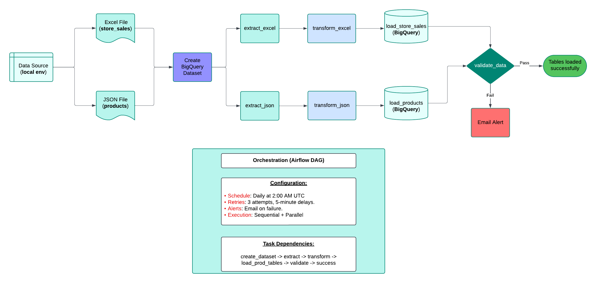

# ETL Pipeline: Excel + JSON → Transform → BigQuery

A production-ready ETL pipeline that extracts data from Excel and JSON sources, transforms it in Python, and loads it into Google BigQuery with comprehensive data quality validation.

##  Architecture



## 📋 Features

- ✅ **Automated Daily Extraction** - Reads from Excel and JSON sources
- ✅ **Python-based Transformation** - Efficient data cleaning and standardization
- ✅ **BigQuery Integration** - Loads cleaned data to Google Cloud
- ✅ **Data Quality Validation** - Comprehensive checks for nulls, duplicates, and referential integrity
- ✅ **Airflow Orchestration** - Automated scheduling with retry logic
- ✅ **Email Alerts** - Notifications on pipeline failures

## 🚀 Quick Start

### Prerequisites

- Python 3.8+
- Apache Airflow 2.0+
- Google Cloud Project with BigQuery enabled
- Service account with BigQuery permissions

### Installation

1. **Clone the repository**
```bash
git clone https://github.com/YOUR_USERNAME/etl-bigquery-pipeline.git
cd etl-bigquery-pipeline
```

2. **Install dependencies**
```bash
pip install -r requirements.txt
```

3. **Set up Google Cloud authentication**
```bash
gcloud auth application-default login
```

4. **Configure the pipeline**

Edit `dags/etl_pipeline.py` and update:
```python
PROJECT_ID = "your-gcp-project-id"
DATASET_ID = "your_dataset_name"
EXCEL_FILE_PATH = "/path/to/your/Store_sales.xlsx"
JSON_FILE_PATH = "/path/to/your/products.json"
```

5. **Copy DAG to Airflow**
```bash
cp dags/etl_pipeline.py $AIRFLOW_HOME/dags/
```

6. **Start Airflow**
```bash
airflow webserver -p 8080
airflow scheduler
```

## 📊 Pipeline Flow
```
Source Files → Create Dataset → Extract → Transform → Load → Validate → Success
                                                              ↓
                                                         Email Alert (on failure)
```

### Pipeline Steps:

1. **Create BigQuery Dataset** - Ensures target dataset exists
2. **Extract Data** - Reads Excel (sales) and JSON (products) files
3. **Transform Data** - Cleans, validates, and standardizes data types
4. **Load to BigQuery** - Writes cleaned data to BigQuery tables
5. **Validate Data** - Runs quality checks:
   - Row count verification
   - Null value detection
   - Duplicate checking
   - Referential integrity
   - Business rule validation

##  Configuration

### Airflow DAG Configuration:
- **Schedule**: Daily at 2:00 AM UTC
- **Retries**: 3 attempts with 5-minute delays
- **Email Alerts**: On failure
- **Execution**: Sequential + Parallel (Excel and JSON paths run in parallel)

### BigQuery Tables:
- `store_sales` - Sales transactions with date, product, units, and amounts
- `products` - Product catalog with IDs, names, and prices

## 📈 Monitoring

Access the Airflow UI at `http://localhost:8080` to:
- Monitor DAG runs
- View task logs
- Check validation reports
- Manually trigger runs

## 🔍 Data Quality Checks

The pipeline validates:
- ✅ No empty tables
- ✅ Row counts match expected values
- ✅ No null values in critical columns
- ✅ No duplicate records
- ✅ All foreign keys valid
- ✅ No negative values in amounts/quantities
- ✅ All prices are positive

## 🛠️ Technologies Used

- **Apache Airflow** - Workflow orchestration
- **Python/Pandas** - Data transformation
- **Google BigQuery** - Data warehouse
- **Google Cloud SDK** - Cloud authentication

## 📧 Contact

**Simon Mokaya**
- Email: mokayasimon495@gmail.com
- GitHub: https://github.com/mokaya21


